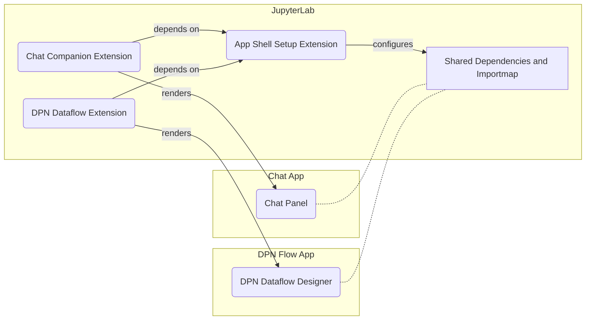

# hv_apps_chat_jupyterlab_ext

This extension exercises the integration of App Shell components into JupyterLab.

It is a single extension that includes both the App Shell Setup and the Chat Companion functionalities.

## Overview

The App Shell Setup extension is responsible for preparing the environment for App Shell components by ensuring shared dependencies and configuring the importmap. On the other hand, the Chat Companion extension renders the Chat Panel from the app located in the `../chat-app` folder into JupyterLab.

### App Shell Setup extension

Any App Shell component requires previous environment setup, namely the availability of the shared dependencies and the configuration of the importmap.

The copying of the shared dependencies bundles are done in the `webpack.config.js`, and the setup of the importmap is part of the App Shell Setup extension (in `src/app-shell-setup-ext`).

The most _hackish_ part of the integration is sharing React, a dependency common to both JupyterLab and App Shell components. JupyterLab uses webpack's module federation, while App Shell relies on standard ES modules. To bridge this, the __webpack_require__ function is exposed as a global variable, allowing React to be re-exported as an ES module in `static/react-from-webpack.js`. **Because of this, the App Shell applications being consumed can't be running in dev mode.**

The App Shell Setup extension needs to be configured with which App Shell application bundles will be consumed and from where. This is done in JupyterLab (Settings > Setting Editor > AppShell Configuration).
The `schema/app-shell-setup.json` contains defaults suitable for the POC, but in practical scenarios, meaningful defaults cannot be provided.

## Chat Companion extension

The Chat Companion extension embeds a Chat Panel into JupyterLab, accessible via the command palette.

The "Open Chat Companion" command opens the chat panel, defaulting to the main area. This can be changed with the "Show Chat Companion on the sidebar" command. The "Close Chat Companion" command closes the chat panel.

## Prerequisites

- JupyterLab >= 4.0.0
- Node.js >= 16

## Running the Chat App

Follow these steps to build and run the Chat App:

```bash
# Navigate to the chat-app directory
cd chat-app

# Install dependencies
npm install

# Build and run the Chat App
npm run build
npm run preview
```

The web application will be accessible at `http://localhost:4173`.

For JupyterLab integration, the Chat App exports a ChatPanel component at `@hv-apps/genai-companion/jupyterlab/ChatWidget.js`.
It is tailored for JupyterLab because it must wrap the component with UI Kit's HvProvider.

Conceptually the UI Kit provider could be in the JupyterLab side, but it would be incapable of importing the UI Kit shared context as it is using a different module format.

## Installing the extension

To install the extension, execute the following commands:

```bash
# Navigate to the hv_apps_chat_jupyterlab_ext directory
# Install the package in development mode
pip install -e "."

# Link your development version of the extension with JupyterLab
jupyter labextension develop . --overwrite

# Rebuild extension Typescript source after making changes
jlpm build
```

You can watch the source directory and automatically rebuild the extension.

```bash
jlpm watch
```

### Uninstalling the extension

```bash
pip uninstall hv_apps_chat_jupyterlab_ext
```

Remove the symlink created by `jupyter labextension develop`. Find the `labextensions` folder via `jupyter labextension list`, then eliminate the `@hv-apps/chat-jupyterlab-ext` symlink.

## Intended Architecture

Our JupyterLab integration is designed to seamlessly incorporate various App Shell applications. The framework is modular, anchored by a core App Shell Setup extension and supplemented by application-specific extensions:

1. **App Shell Setup extension**: This is the foundational extension that handles the setup of shared dependencies and the importmap, crucial for the compatibility and integration of App Shell components within JupyterLab.

2. **Application-Specific extensions**: These are extensions that integrate individual App Shell applications into JupyterLab. Each extension relies on the App Shell Setup Extension for shared dependencies and importmap configuration.

The example diagram below visually represents the modular architecture and the dependencies between the components:



## To be tackled

- **Extension Separation**: The two extensions (App Shell Setup and Chat Companion) are currently combined. They should be separate extensions. But how can then the Chat Companion consume the tokens (and utils) from the App Shell Setup extension?
- **Configuration Approach**: How can the App Shell Setup extension be configured with the App Shell applications to be consumed? It is currently "by-hand" in the Settings > Setting Editor > AppShell Configuration. The POC has hardcoded values as defaults in `schema/app-shell-setup.json`, but in a real scenario no meaningful defaults can be provided as we don't know which App Shell applications will be consumed and where are they hosted.
- **Sidebar width**: Why does the sidebar start with 0 pixels width? It should start with some default reasonable width.
